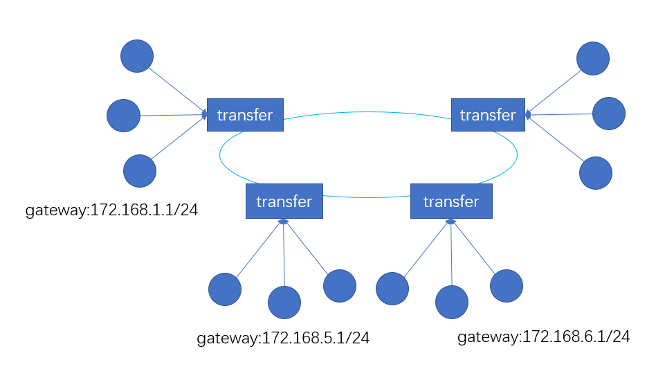

# EasyMesh文档

## 简介
本项目提供云网络服务，用于多地区组网技术，相当于将多个地域网络虚拟统一局域网，方便团队跨地域网络访问；提供统一控制面板进行管理，并且利用P2P技术提升节点近点加速；如果多个节点处于内网，那么会优先采用内网进行互通；并且支持多云转发管理；根据网络时延动态路由；

## 实验性版本
1. 支持 windows & linux 客户端、服务端程序
2. 支持手动网络配置，云转发；
3. 支持多网络平面隔离；

### [版本地址](https://github.com/easymesh/release/releases/tag/v0.1.0) 

### [部署文档](./v0.1.0.md)
